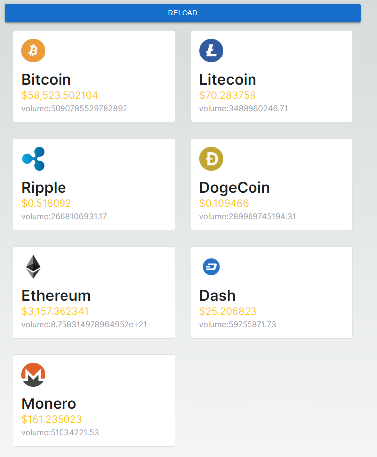
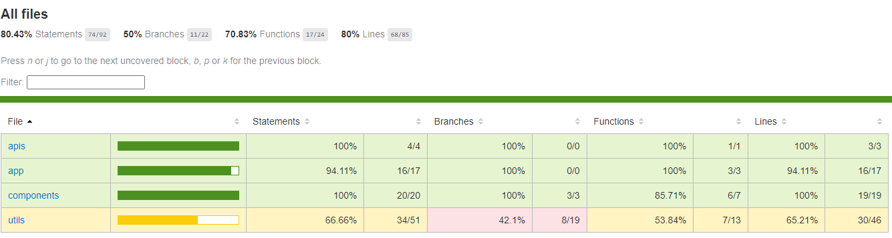

### relative project:

[Frontend](https://github.com/shawerestart/coin-assets-demo)

[Backend](https://github.com/shawerestart/coin-assets-demo-backend)


## Getting Started

```bash
yarn install
```

First, run the development server:

<ul>
<li>copy .env.example to .env</li>
<li>enter your api key in .env</li>
<li>enter your api url in .env</li>
</ul>

```bash
yarn dev
```

Open [http://localhost:3000](http://localhost:3000) with your browser to see the result.

### Supported Features

✅ Support Responsive Design powered by Tailwind CSS

✅ Test Coverage 81.91%;

✅ introduction of architecture design

✅ Using Node.js and React with TypeScript

✅ Consideration of scalability, you can add your need components to the components folder and import them in the app router. and you can set your api key and api url in .env file.

✅ Consideration of minimizing charging fees for api calls, we use fetch with cache to call api. you can set your favorite cache time when api call.

❌ (Optional) Dockerizing the whole application, coming soon...

✅ (Optional) Implementation of extra features you can think of (we provide asset icon and reload function for the icon asset preview page)


You can start editing the page by modifying `app/page.tsx`. The page auto-updates as you edit the file.

### Architecture

```

├─apis
│  └─ API file entry
├─app
│  └─directory to app router entry
├─components
│  └─public component entry
├─public
│  └─ public files, include icons, public file etc.
├─types
│  └─ typescript types files
└─utils
   └─ any util files
.env  // environment path config

```

### Preview



### Test Corverage




